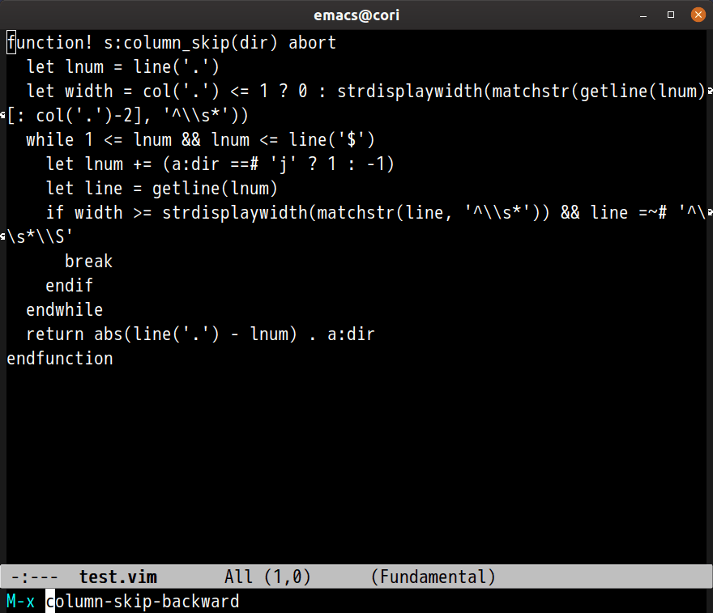

# column-skip.el 

Emacs port of Vim extension [columnskip.vim](https://github.com/tyru/columnskip.vim)

## Image



## Commands

### `M-x column-skip-forward`

Forward line to same column line

### `M-x column-skip-backward`

Backward line to same column line

## Sample Configuration

```lisp
(global-set-key (kbd "C-x n") #'column-skip-forward)
(global-set-key (kbd "C-x p") #'column-skip-backward)
```
